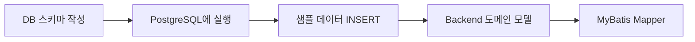
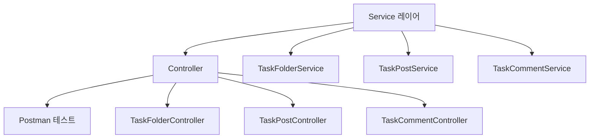
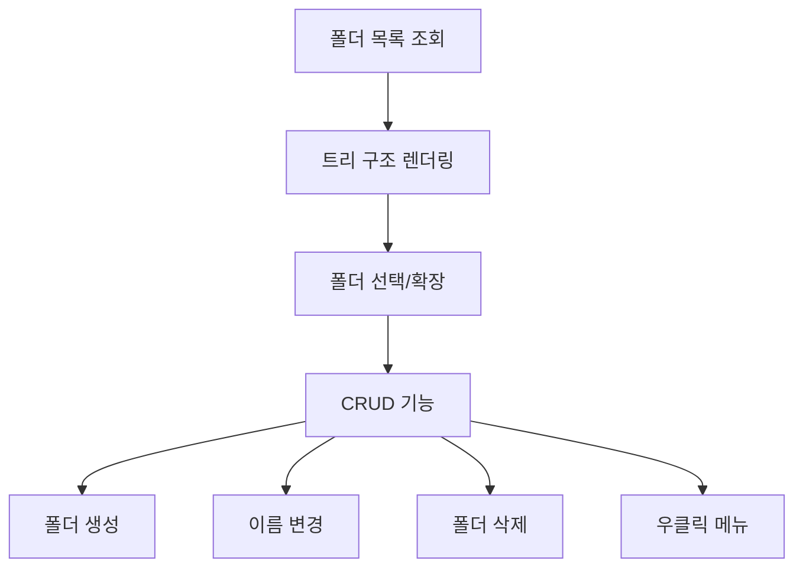
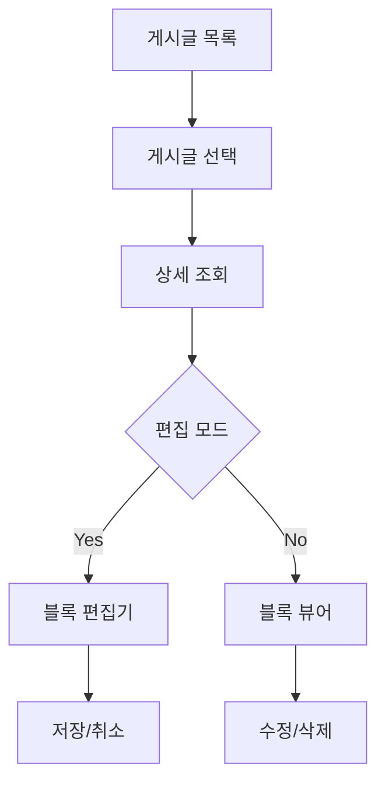
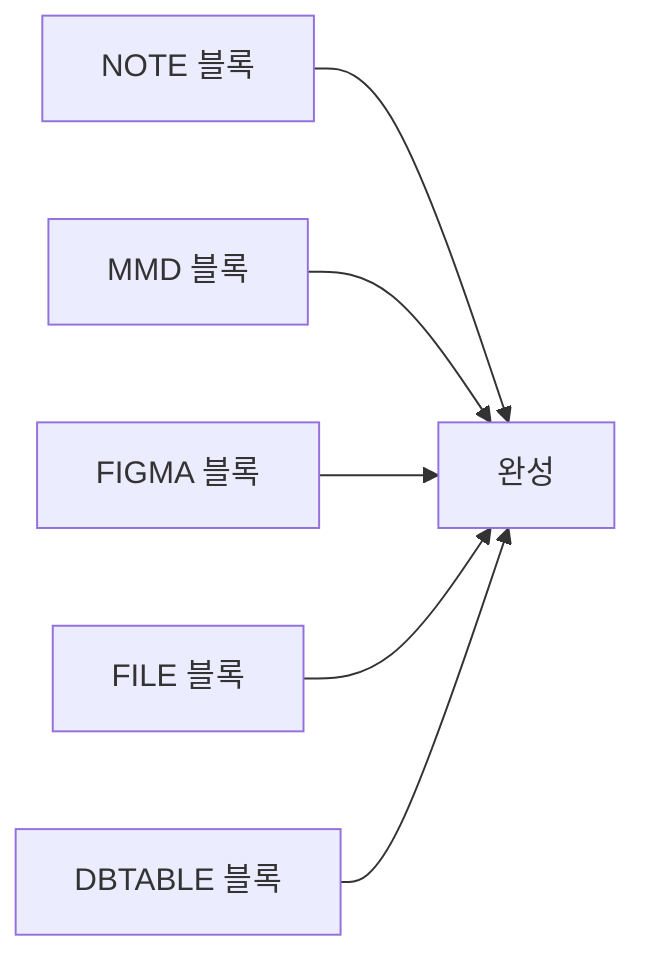
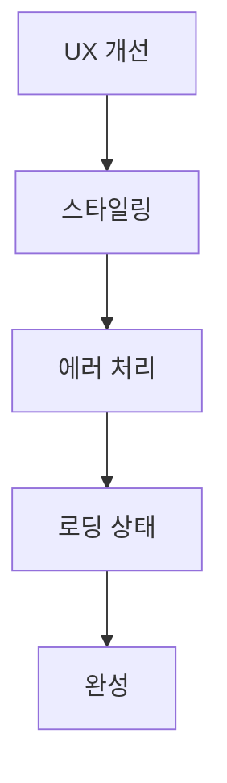

# 구현 순서

## Phase 1: 기반 작업 (Day 1)



### 체크리스트
- [ ] `task_folders` 테이블 생성
- [ ] `task_posts` 테이블 생성
- [ ] `task_blocks` 테이블 생성
- [ ] `task_comments` 테이블 생성
- [ ] 샘플 폴더 3개 생성
- [ ] 샘플 게시글 5개 생성
- [ ] TaskFolder.java 작성
- [ ] TaskPost.java 작성
- [ ] TaskBlock.java 작성
- [ ] BlockType enum 작성
- [ ] TaskFolderMapper.xml 작성
- [ ] TaskPostMapper.xml 작성

---

## Phase 2: Backend API (Day 2)



### 체크리스트
- [ ] TaskFolderService CRUD
- [ ] TaskPostService CRUD (블록 포함)
- [ ] TaskCommentService CRUD
- [ ] Controller 구현
- [ ] Postman으로 전체 API 테스트
- [ ] 권한 체크 추가 (Interceptor)

---

## Phase 3: Frontend 기본 구조 (Day 3)


### 체크리스트
- [ ] task.types.ts 작성
- [ ] taskApi.ts 작성
- [ ] useTaskFolders hook
- [ ] useTaskPosts hook
- [ ] useTaskComments hook
- [ ] /tasks 라우트 생성
- [ ] 3단 레이아웃 (사이드바 | 목록 | 상세)
- [ ] 사이드바 리사이징

---

## Phase 4: 폴더 트리 (Day 4)



### 체크리스트
- [ ] 폴더 트리 렌더링 (재귀)
- [ ] 폴더 선택 시 게시글 목록 조회
- [ ] 폴더 확장/축소
- [ ] 우클릭 컨텍스트 메뉴
- [ ] 폴더 생성 (인라인 입력)
- [ ] 폴더 이름 변경
- [ ] 폴더 삭제 (확인 다이얼로그)

---

## Phase 5: 게시글 CRUD (Day 5)



### 체크리스트
- [ ] 게시글 목록 컴포넌트
- [ ] 게시글 상세 조회
- [ ] 편집 모드 전환
- [ ] 제목 입력
- [ ] 블록 추가/삭제/순서 변경
- [ ] 저장 기능
- [ ] 삭제 기능 (확인 다이얼로그)

---

## Phase 6: 블록 시스템 (Day 6-7)



### Day 6: 에디터
- [ ] NOTE 에디터 (textarea)
- [ ] MMD 에디터 (textarea + 미리보기)
- [ ] FIGMA 에디터 (URL 입력)
- [ ] FILE 에디터 (JSON 입력)
- [ ] DBTABLE 에디터 (테이블 폼)

### Day 7: 뷰어
- [ ] NOTE 뷰어 (pre-wrap)
- [ ] MMD 뷰어 (MermaidChart)
- [ ] FIGMA 뷰어 (iframe)
- [ ] FILE 뷰어 (다운로드 링크)
- [ ] DBTABLE 뷰어 (테이블)

---

## Phase 7: DBTABLE TSV 파싱 (Day 8)

```mermaid
flowchart TD
    A[DBeaver/Excel] --> B[Ctrl+C<br/>TSV 복사]
    B --> C[붙여넣기 영역]
    C --> D[TSV 파싱]
    D --> E[DbColumn[] 생성]
    E --> F[테이블 렌더링]
```

### 체크리스트
- [ ] TSV 붙여넣기 textarea
- [ ] parseTsvToColumns 함수
- [ ] DbColumn 배열 생성
- [ ] 테이블 에디터 렌더링
- [ ] 행 추가/삭제
- [ ] 컬럼 편집 (inline input)

---

## Phase 8: 댓글 (Day 9)


### 체크리스트
- [ ] 댓글 목록 컴포넌트
- [ ] 댓글 입력 textarea
- [ ] 댓글 등록 (Ctrl+Enter)
- [ ] 댓글 삭제
- [ ] 작성자 정보 표시

---

## Phase 9: 폴리싱 (Day 10)



### 체크리스트
- [ ] 로딩 스피너
- [ ] 에러 토스트
- [ ] 빈 상태 메시지
- [ ] 반응형 레이아웃 (옵션)
- [ ] 권한별 버튼 표시/숨김
- [ ] 최종 테스트

---

## 마일스톤

| Day | 목표 | 완료 조건 |
|-----|------|----------|
| 1 | DB + Backend 기반 | Postman에서 폴더/게시글 조회 가능 |
| 2 | Backend API 완성 | 전체 API 테스트 통과 |
| 3 | Frontend 기본 구조 | 레이아웃 렌더링 |
| 4 | 폴더 트리 | 폴더 CRUD 작동 |
| 5 | 게시글 CRUD | 게시글 생성/조회/수정/삭제 |
| 6-7 | 블록 시스템 | 5가지 블록 타입 모두 작동 |
| 8 | DBTABLE 파싱 | TSV 붙여넣기 → 테이블 생성 |
| 9 | 댓글 | 댓글 CRUD |
| 10 | 폴리싱 | 배포 준비 완료 |
