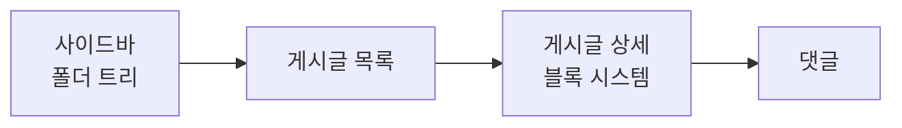
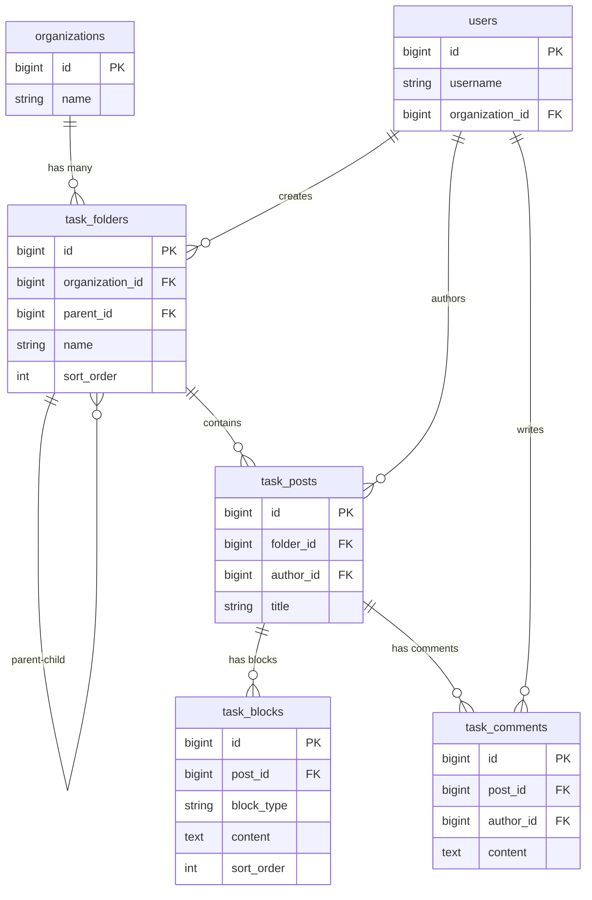
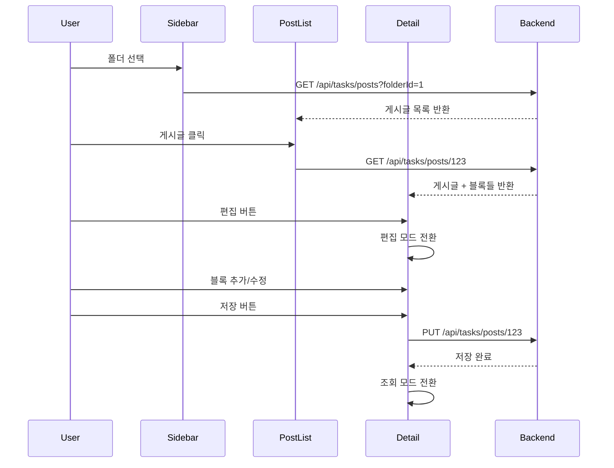
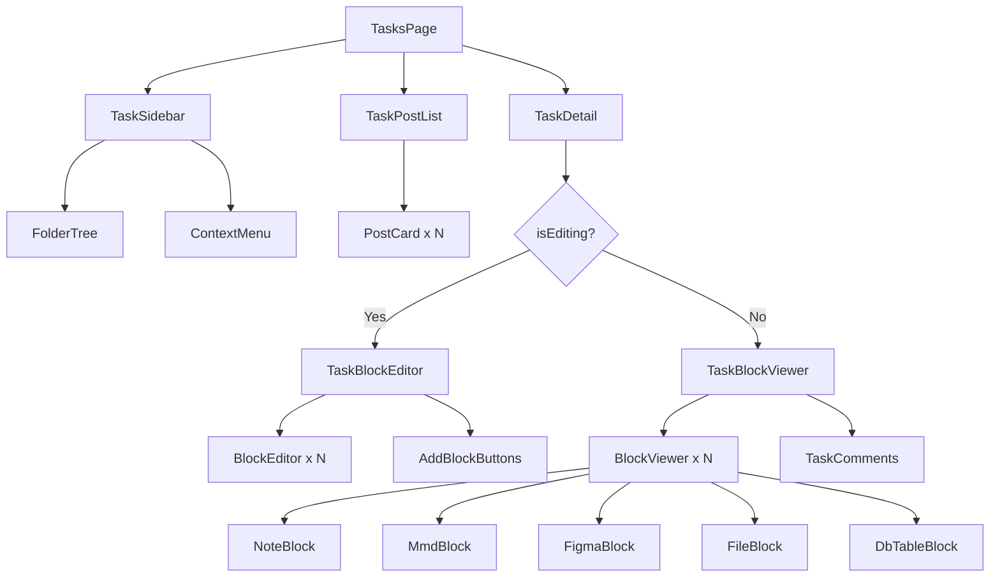

# 업무 관리 시스템 구조도

## 화면 레이아웃



## 데이터 구조



## 블록 타입 시스템

```mermaid
flowchart TD
    A[TaskBlock] --> B{blockType}
    B -->|NOTE| C[마크다운 텍스트]
    B -->|MMD| D[Mermaid 다이어그램]
    B -->|FIGMA| E[Figma 임베드]
    B -->|FILE| F[파일 첨부]
    B -->|DBTABLE| G[DB 테이블 정의]

    C --> C1[content: string]
    D --> D1[content: mermaid code]
    E --> E1[content: figma URL]
    F --> F1[content: JSON<br/>{url, filename, desc}]
    G --> G1[content: JSON<br/>{tableName, columns...}]
```

## 사용자 플로우



## 컴포넌트 구조


