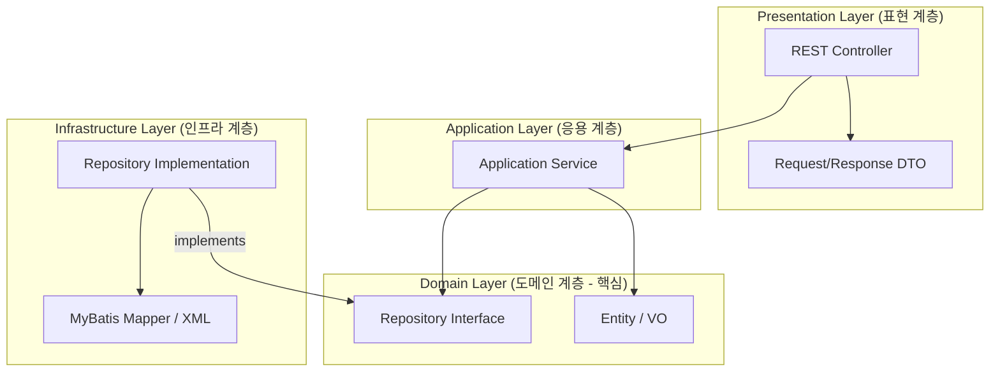

# 프로젝트 아키텍처 개요

이 문서는 백엔드(`parantier-api`) 및 프론트엔드(`parantier-front`) 프로젝트의 아키텍처 패턴과 패키지 구조를 설명합니다.

---

## 1. 백엔드: 도메인 주도 설계 (DDD: Domain-Driven Design)

백엔드는 **도메인 주도 설계(DDD)** 원칙을 기반으로 하는 **모듈형 모놀리스(Modular Monolith)** 접근 방식을 따릅니다. 각 도메인(바운디드 컨텍스트)은 독립적인 계층 구조를 가지고 있습니다.

### 패키지 구조 (예시: `user` 도메인)

```text
com.mapo.palantier.user
├── application         # 응용 계층 (유스케이스 오케스트레이션)
│   ├── AuthService.java
│   └── UserService.java
├── domain              # 도메인 계층 (핵심 비즈니스 로직)
│   ├── RefreshToken.java (엔티티/VO)
│   ├── RefreshTokenRepository.java (저장소 인터페이스)
│   ├── User.java (엔티티)
│   ├── UserRepository.java (저장소 인터페이스)
│   └── UserRole.java (열거형/VO)
├── infrastructure      # 인프라 계층 (기술적 연동 및 상세 구현)
│   ├── UserMapper.java (MyBatis 인터페이스)
│   └── UserRepositoryImpl.java (저장소 구현체)
└── presentation        # 표현 계층 (API 엔드포인트 및 사용자 인터페이스)
    ├── AuthController.java
    ├── UserController.java
    └── dto             # 요청/응답 DTO들
        ├── LoginRequest.java
        └── UserDetailResponse.java
```

### 계층별 역할 및 책임

| 계층 | 역할 | 주요 구성 요소 |
| :--- | :--- | :--- |
| **Presentation (표현)** | HTTP 요청 처리, 입력 값 검증 및 응답 반환을 담당합니다. | Controller, DTO, GlobalExceptionHandler |
| **Application (응용)** | 도메인 객체들을 조율하여 특정 유스케이스를 수행합니다. 비즈니스 규칙은 포함하지 않습니다. | Application Service, 트랜잭션 관리 |
| **Domain (도메인)** | 시스템의 핵심 영역입니다. 비즈니스 로직, 엔티티, 저장소 인터페이스를 포함합니다. | Entity, Value Object, Repository SPI |
| **Infrastructure (인프라)** | 도메인 계층의 인터페이스를 기술적인 프레임워크를 통해 실질적으로 구현합니다. | MyBatis Mapper, DB Repository, 외부 API 연동 |

### 아키텍처 다이어그램 (Backend)



---

## 2. 프론트엔드: 피처 슬라이스 디자인 (FSD: Feature-Sliced Design)

프론트엔드는 범위와 영향도에 따라 코드를 계층별로 조직화하는 **피처 슬라이스 디자인(FSD)** 패턴을 따릅니다.

### 폴더 구조

```text
parantier-front/src
├── app          # 앱 초기화 (Provider, 전역 스타일, 라우팅 엔트리 등)
├── processes    # (선택 사항) 복잡한 다단계 프로세스 흐름
├── pages        # 애플리케이션의 전체 페이지 구성
├── widgets      # 화면 조성을 위한 독립적인 구성 단위 (예: Header, Sidebar)
├── features     # 사용자에게 가치를 제공하는 주요 기능 (예: 댓글 작성, 작업 수정)
├── entities     # 비즈니스 엔티티 (예: User, Task, Comment 관련 데이터와 연동 로직)
└── shared       # 범용적으로 재사용 가능한 단위 (UI 컴포넌트, 유틸리티, API 클라이언트)
```

### 계층별 설명

*   **App**: 전역 설정, 테마 및 라우팅의 진입점 역할을 수행합니다.
*   **Pages**: 위젯들을 조합하여 완성된 레이아웃을 구성합니다.
*   **Widgets**: 하나 이상의 기능이나 엔티티가 조합된 고수준 UI 블록입니다.
*   **Features**: 사용자가 직접 조작하여 가치를 창출하는 비즈니스 액션 로직이 담깁니다.
*   **Entities**: 데이터 모델과 그에 부수되는 로직, API 연결점이 위치합니다 (예: `UserCard`, `useUser` 훅).
*   **Shared**: 기술적인 기초 단위입니다. Tailwind 설정, UI Kit, 공용 유틸 등을 포함합니다.

### 종속성 규칙
FSD는 다음과 같은 **단방향 종속성 흐름**을 강제하여 코드의 결합을 방지합니다:
`app` > `pages` > `widgets` > `features` > `entities` > `shared`

---

## 3. 기술 스택 요약

*   **Backend**: Java 17+, Spring Boot 3.x, MyBatis, Postgres/SQLite.
*   **Frontend**: React, TypeScript, Tailwind CSS, Vite.
